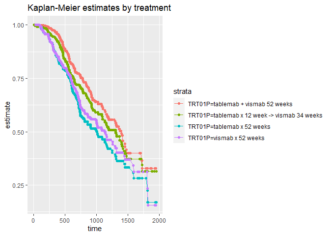

Example Survival data set
================

## Background

The example data set is based on large phase III clinical trials in
Breast cancer such as
[ALTTO](https://ascopubs.org/doi/pdf/10.1200/JCO.2015.62.1797).

The “trial” aims to determine if a combination of two therapies tablemab
(T) plus vismab (V) improves outcomes for metastatic human epidermal
growth factor 2–positive breast cancer and increases the pathologic
complete response in the neoadjuvant setting (treatment given as a first
step to shrink a tumor before the main treatment or surgery).

The trial has four treatment arms, patients with centrally confirmed
human epidermal growth factor 2-positive early breast cancer were
randomly assigned to 1 year of adjuvant therapy with V, T, their
sequence (T→V), or their combination (T+V) for 52 weeks. The primary end
point was progression-free survival (PFS).

## The data set and variable definitions

The data set contains the following variables:

  - STUDYID - the study id
  - SUBJID - subject id
  - USUBJID - unique subject id
  - AGE - age at randomisation
  - STR01 - Hormone receptor status
  - STR01N - Hormone receptor positive (Numeric)
  - STR01L - Hormone receptor positive (Long format)
  - STR02 - Prior Radiotherapy at randomisation
  - STR02N - Prior Radiotherapy at randomisation (Numeric)
  - STR02L - Prior Radiotherapy at randomisation (Long format)
  - TRT01P - Planned treatment assigned at randomisation
  - TRT01PN - Planned treatment assigned at randomisation (numeric)
  - PARAM - Analysis parameter
  - PARAMCD - Analysis parameter code
  - AVAL - Analysis value (time)
  - CNSR - Censoring (1 = censored)
  - CNSDTDSC - Event or censoring description
  - DCTREAS - Discontinuation from study reason

## Example analysis

Below is a crude example of how to plot Kaplan-Meier estimates by
treatment.

``` r
library(tidyverse)    
library(broom)
library(survival)

# load data
ADTTE <- read_csv('2020-04-08-psi-vissig-adtte.csv')

# plot KM curve by treatment 
survfit(Surv(AVAL, CNSR == 1) ~ TRT01P  , data = ADTTE )  %>%
  tidy(fit) %>%
  ggplot(aes(time, estimate, group = strata, colour = strata)) + 
  geom_line() +
  geom_point() +
  ggtitle("Kaplan-Meier estimates by treatment") 
```

<!-- -->
